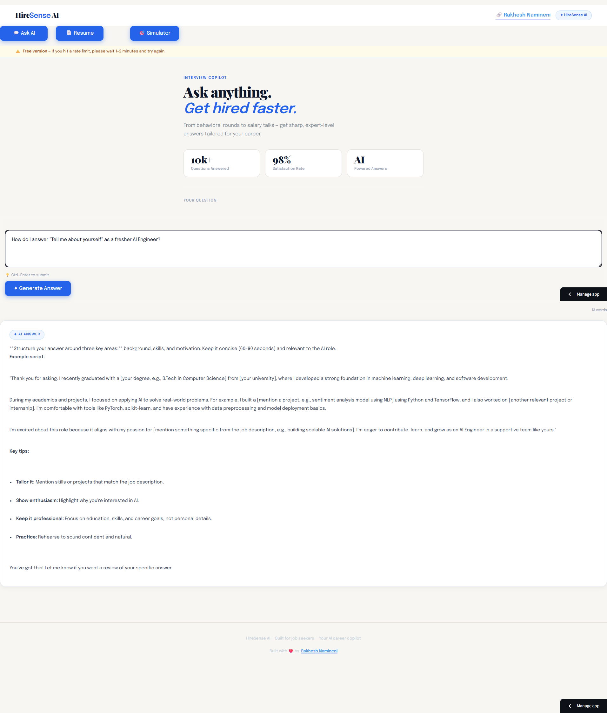
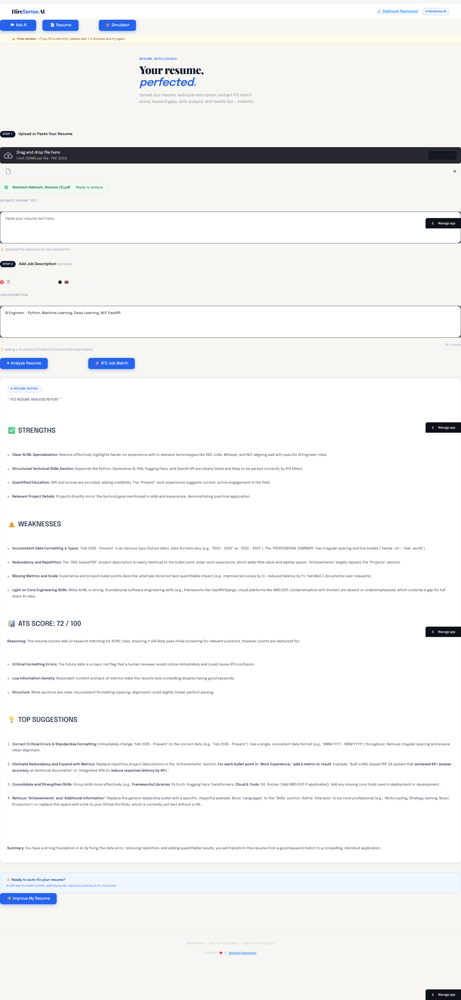
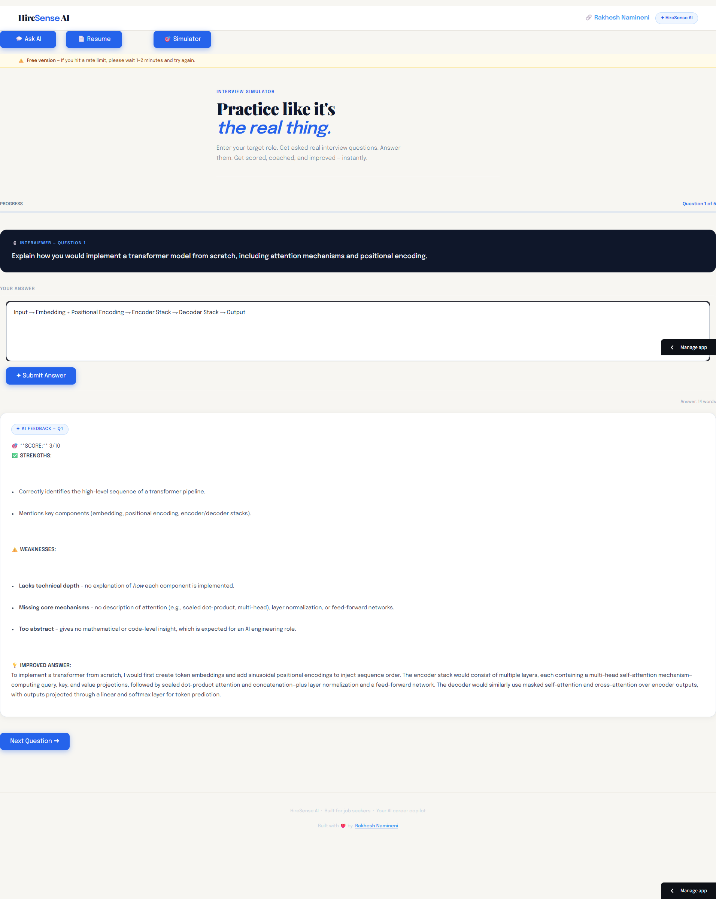

# 🚀 HireSense AI — Your AI Career Copilot

> Built for OxBuild Hackathon by Oxlo.ai | Powered by Oxlo.ai API (deepseek-v3.2)

## 📌 Use Case

Job seekers struggle with:
- Not knowing how to answer interview questions
- Weak resumes that fail ATS filters
- Poor ATS match with job descriptions
- No way to auto-improve their resume
- No real interview practice

**HireSense AI solves all 5 problems in one app.**

---

## ✨ Features

### 💬 1. Ask AI
- Ask any career or interview question
- Get instant expert-level answers
- Examples: "How do I answer Tell me about yourself?", "How to negotiate salary?"

### 📄 2. Resume Analyzer
- Upload PDF or DOCX resume — or paste resume text directly
- Get ATS Score out of 100
- Strengths & Weaknesses analysis
- 4 actionable improvement suggestions

### 🎯 3. ATS Job Match
- Paste any job description
- AI compares your resume vs JD
- Get ATS Match Score (%)
- Missing keywords, skills gap, rewrite suggestions

### ✨ 4. AI Resume Improver
- One click auto-rewrites your entire resume
- Adds missing keywords for ATS
- Rewrites weak bullet points with action verbs
- Improves summary section
- Download improved resume as .docx

### 🎙️ 5. Interview Simulator
- Enter your target role
- Get asked 5 real interview questions
- Submit your answers
- Get scored out of 10 with feedback
- See strengths, weaknesses & model answers
- Final report with average score

---

## 🤖 Model Used

- **Model:** `deepseek-v3.2`
- **Platform:** [Oxlo.ai](https://portal.oxlo.ai)
- **API:** Oxlo.ai Chat Completions API
- **Endpoints used:** `/v1/chat/completions`

---

## 🛠️ Tech Stack

| Technology | Usage |
|---|---|
| Streamlit | Frontend UI |
| Oxlo.ai API | AI responses |
| pypdf | PDF text extraction |
| python-docx | DOCX read & write |
| python-dotenv | API key management |
| requests | API calls |

---

## 🚀 Live Demo

🔗 **[HireSense AI — Live App](https://hiresense-ai-vdrhyelxtvk9ac7ngrnhtn.streamlit.app)**

---

## ⚙️ Setup & Run Locally
```bash
git clone https://github.com/Rakhesh143/hiresense-ai.git
cd hiresense-ai
pip install -r requirements.txt
```

Create `.env` file:
```
OXLO_API_KEY=your_oxlo_api_key_here
```

Run:
```bash
streamlit run app.py
```

---

## 📁 Project Structure
```
hiresense-ai/
├── app.py              # Main Streamlit application
├── requirements.txt    # Python dependencies
├── .env                # API key (not uploaded to GitHub)
└── README.md           # Project documentation
```

---

## ⚠️ Known Limitations

- Free API tier — 60 requests/day limit
- No user login or saved history
- English responses only
- 5 questions per simulator session
- Session data clears on browser refresh

---

## 🔮 Future Improvements

- User authentication & saved history
- Streaming AI responses (ChatGPT-style)
- Multi-language support
- More simulator questions
- PDF download for simulator report
- Pro API for faster responses
- Resume version history & comparison
- Job listing integration (LinkedIn, Naukri)
- Mock HR round with voice input
- Dashboard to track interview progress over time

---

## 👨‍💻 Built By

**Rakhesh Namineni**
- Final-year B.Tech CS Student
- Aspiring AI Engineer from Andhra Pradesh, India
- 📧 naminenirakesh@gmail.com
- 🌐 [Portfolio](https://rakheshportfolio.netlify.app)
- 🔗 [LinkedIn](https://linkedin.com/in/rakhesh-namineni431)
- 🐙 [GitHub](https://github.com/Rakhesh143)

---

## 🏆 OxBuild Hackathon Submission

- **Event:** OxBuild — Oxlo.ai's First Developer Hackathon
- **Submission Date:** April 5, 2026
- **Model Used:** `deepseek-v3.2` via Oxlo.ai API
- **Registered Oxlo.ai Email:** naminenirakesh@gmail.com


---
## 📸 Screenshots

### 💬 Ask AI


### 📄 Resume Analyzer


### 🎯 ATS Job Match


### ✨ Improve My Resume


### 🎙️ Interview Simulator

